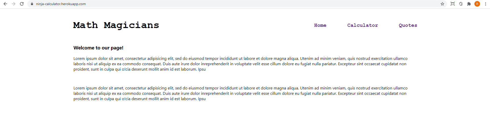
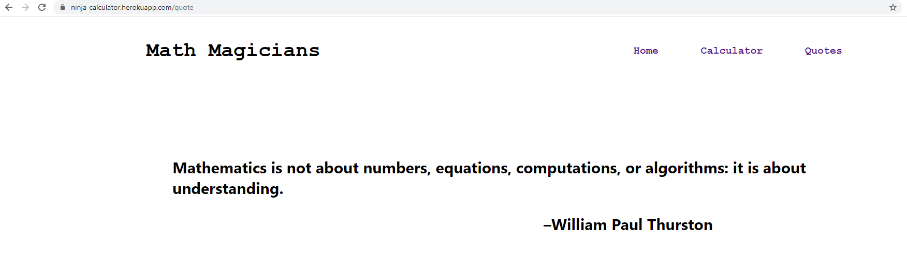

# React Calculator

> This App is built using React

## Project Description

This is a simple calculator app created using the React library.
The calculator is able to perform basic mathematical calculations and display the results.
The main objective of this assignment is to learn about react components, state and props, hooks and other react functions.

## Built With

- React
- HTML and CSS
- Heroku
- Eslint and Stylelint as linters
- React Testing library and Jest for DOM and Snapshot testing

## Live Demo

[Demo Link](https://ninja-calculator.herokuapp.com/)

## Project Setup

- Fork this GitHub repository
- Clone the repository to your machine
- Run 'npm install' to install the project dependencies
- Run 'npm start' to load the application on your browser
- Above command should open this URL http://localhost:8080/ on your browser.

### `npm start`

Runs the app in the development mode.\
Open [http://localhost:3000](http://localhost:3000) to view it in the browser.

The page will reload if you make edits.\
You will also see any lint errors in the console.

### `npm test`

Launches the test runner in the interactive watch mode.\

## Authors

👤 **Rajkumar Das**

- Github: [@rajkumardas2701](https://github.com/rajkumardas2701)
- Twitter: [@Rajkuma58621299](https://twitter.com/Rajkuma58621299)
- Linkedin: [Rajkumar Das](https://www.linkedin.com/in/rajkumar-das-41308961/)

## 🤝 Contributing

Contributions, issues and feature requests are welcome!

Feel free to check the [issues page](https://github.com/rajkumardas2701/calculator/issues).

## Show your support

Give a ⭐️ if you like this project!

## 📝 License

This project is [MIT](lic.url) licensed.